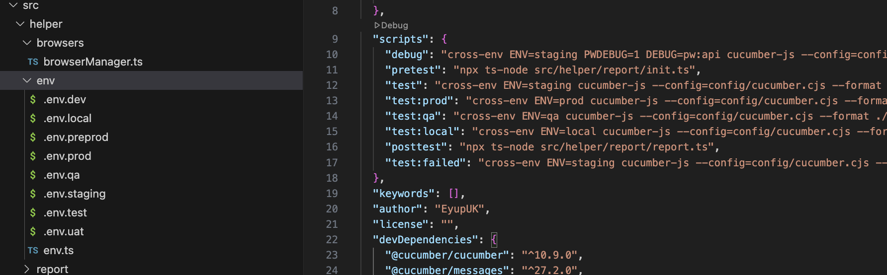
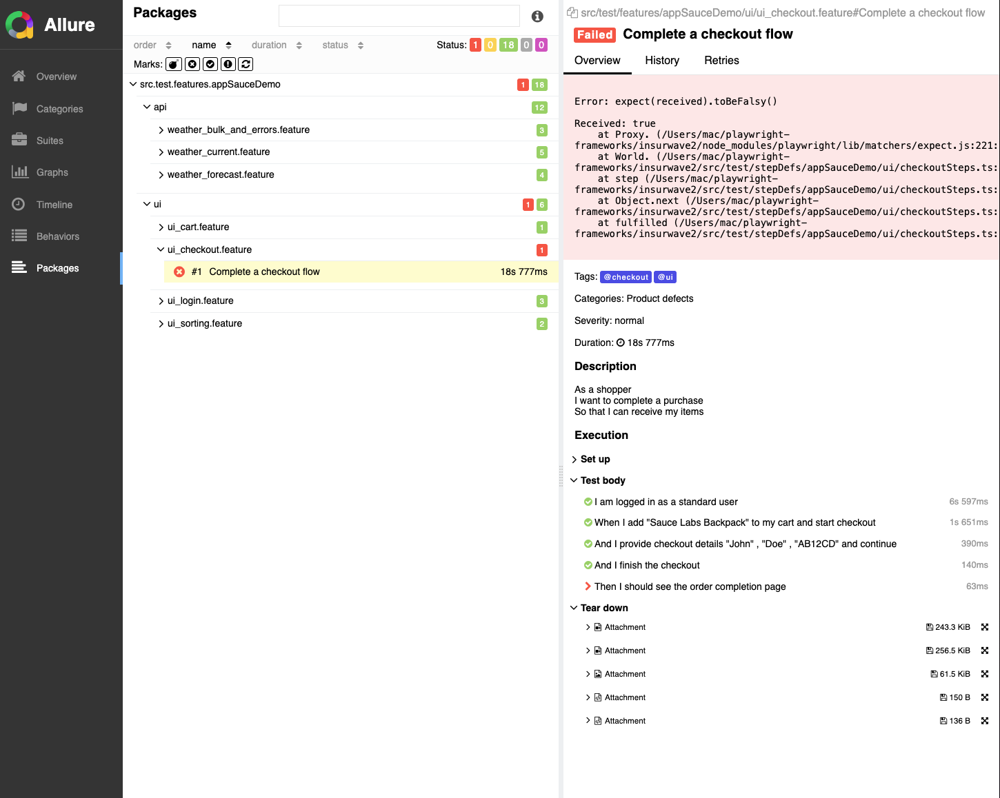
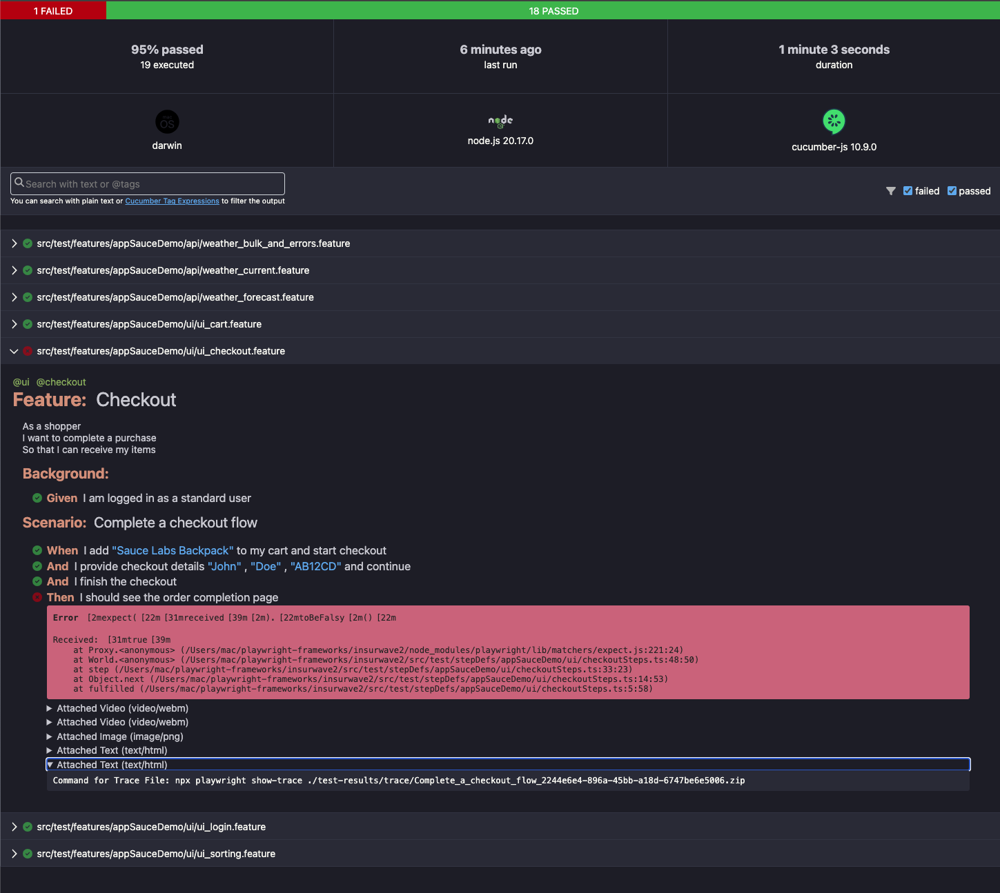
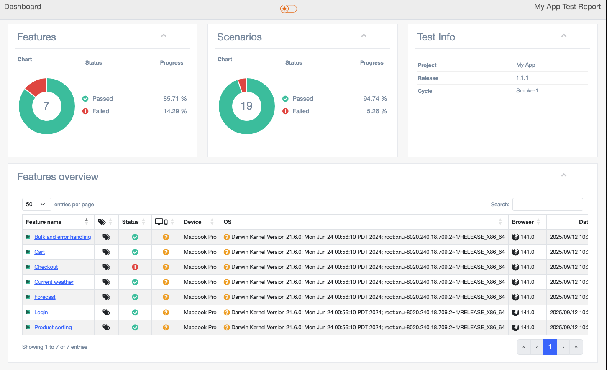
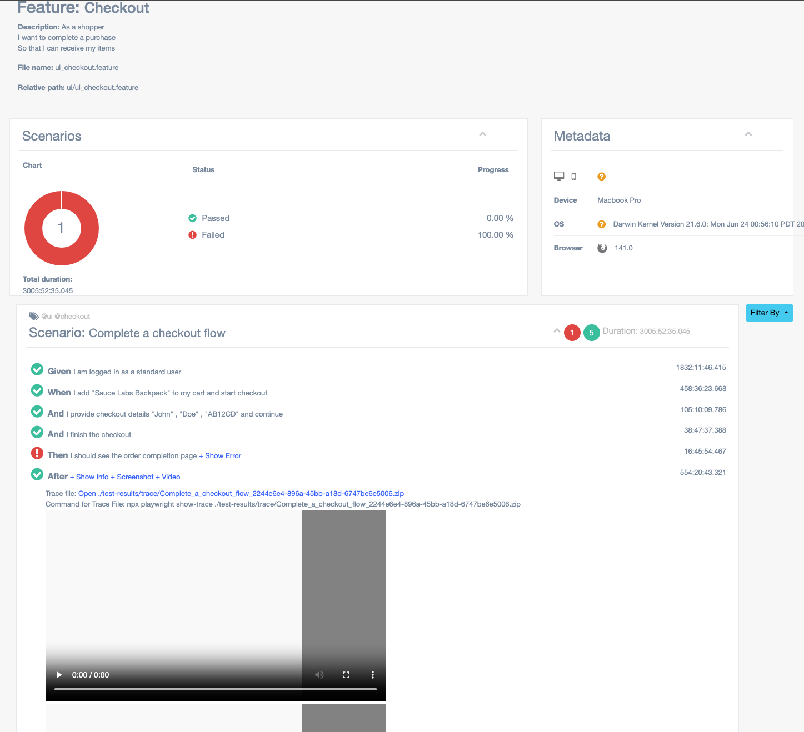

# Playwright + Cucumber + TS

Cucumber is a popular behavior-driven development (BDD) tool that allows developers and stakeholders to collaborate on defining and testing application requirements in a human-readable format.
TypeScript is a powerful superset of JavaScript that adds optional static typing, making it easier to catch errors before runtime. By combining these two tools, we can create more reliable and maintainable tests.

## Prerequisites

Before setting up and running the project, ensure you have the following installed on your system:

1. **Node.js** (v16 or higher)  
   Download and install from [Node.js official website](https://nodejs.org/).

2. **npm** (comes with Node.js)  

   ```bash
    node -v
    npm -v
   ```

3. **Playwright Browsers**  

   ```bash
   npx playwright install
   ```

4. **Allure Commandline** (for generating reports)  
    Install globally using:

   ```bash
   npm install -g allure-commandline --save-dev
   npm install --save-dev @cucumber/cucumber @cucumber/messages allure-cucumberjs
   ```

5. **Git** (optional, for cloning the repository)  
   Download and install from [Git official website](https://git-scm.com/).

6. **K6**

- [k6](https://k6.io/docs/getting-started/installation/) installed on your system (`brew install k6` on Mac)
- A valid WeatherAPI key (set as an environment variable)

```BASH
brew install k6
```

---

## Features

1. Awesome report with screenshots, videos & logs
2. Execute tests on multiple environments
3. Parallel execution
4. Rerun only failed features
5. Retry failed tests on CI of flaky tests
6. Github Actions integrated with downloadable report
7. Page object model
8. Cross-browser testing

## Project structure

- .github -> yml file to execute the tests in GitHub Actions
- src -> Contains all the features & Typescript code
- test-results -> Contains all the reports related file
- config -> Contains Cucumber options and report settings

## Reports

1. [Mutilple Cucumber Report](https://github.com/WasiqB/multiple-cucumber-html-reporter)
2. Default Cucumber report
3. [Logs](https://www.npmjs.com/package/winston)
4. Screenshots of failure
5. Test videos of failure
6. Trace of failure

## Get Started

### Setup:

1. Clone or download the project
2. Extract and open in the VS-Code
3. to install the dependencies

```bash
npm i
```

4. to install the browsers

```bash
npx playwright install
```

5. to execute the tests (was by deafault set to **staging** environment in .env.staging);

```bash
npm run test
```

6. To run a particular test, change:

```bash
  paths: [
            "src/test/features/featurename.feature"
         ]
```

7. Use tags to run a specific or collection of specs:

```bash
npm run test --tags="@cart"
```

8. Run scenarios on a specific browser, assigning **chrome** (chromium), **firefox** or **webkit** (safari) to the key browser:

```bash
BROWSER=firefox npm run test --tags="cart"
```

if browser kept empty, the framework fetch the browser type from .env file.
If the browser is empty or unassigned in .env file, browserManager.ts will assign the default browser.

9. Rerun failed sceanarios after the test execution by

```bash
npm run test --tags="api"
npm run test:failed
```

10. To install Allure Report:

```bash
npm install -g allure-commandline --save-dev
npm install --save-dev @cucumber/cucumber @cucumber/messages allure-cucumberjs
```

11. To generate Allure Report:

```bash
allure serve allure-results
```

12. To run parallel:

```bash
PARALLEL=<numberOfThread> npm run test
```

13. To run tests in headless mode:

```bash
HEAD=false npm run test
```

14. To execute tests by custom environment settings, use custom scripts relying on .env files, like:

```bash
npm run test:qa
```



## Performance Testing

1. **Run the k6 test script:**

   ```bash
   WEATHERAPI_KEY=your_actual_key k6 run --summary-export=weather-api-result.json src/performance/weather-api.k6.js
   ```

   - This will execute the test and export a summary JSON file.

- **Cloud execution on Grafana:**
How to generate a k6 API token in Grafana Cloud
- Log in to your Grafana Cloud account, and select the Stack you’re using. 

- In the left menu navigate to: Testing & Synthetics → Performance → Settings 

- In the Settings page, there should be a section called Access (or similar) where you can see Personal token. You can view / copy / regenerate your personal API token there. 

- (Optional) If you have the right permissions (admin), you can also generate a Stack token (applies across the stack) under the same “Settings → Access / Stack token” section. 

- Once you have the token, you can run:

``` bash
k6 cloud login --token <YOUR_TOKEN>
```

- To execute on Grafana:

  ```bash
  npm run k6:cloud
  ```

- **Grafana Cloud Visualization (with local execution):**

  ```bash
  npm run k6:grafana
  ```

- See `.github/workflows/k6-grafana.yml` for CI integration.

### Customizing the Test

- Edit `src/performance/weather-api.k6.js` to change the number of virtual users (`vus`), duration, cities, or endpoints.

- You can parameterize the API key and base URL using environment variables:

  ```bash
  WEATHERAPI_KEY=your_actual_key WEATHERAPI_BASEURL=https://api.weatherapi.com/v1 k6 run src/performance/weather-api.k6.js
  ```

### Folder structure

0. `src\pages` -> All the page (UI screen)
1. `src\test\features` -> write your features here
2. `src\test\stepDefs` -> Your step definitions goes here
3. `src\hooks\hooks.ts` -> Browser setup and teardown logic
4. `src\hooks\pageFixture.ts` -> Simple way to share the page objects to steps
5. `src\helper\env` -> Multiple environments are handled
6. `src\helper\types` -> To get environment code suggestions
7. `src\helper\report` -> To generate the report
8. `config/cucumber.js` -> Manages Cucumber options and reports
9. `package.json` -> Contains all the dependencies
10. `src\helper\util` -> Read test data from json & logger

**Bonus:** Integrated to GitHub Actions

## Folder Structure

```bash
Playwright-Cucumber-TS
├── .github
│   └── workflows
│       └── ci.yml
├── allure-results
├── src
│   ├── pages
│   │   └── examplePage.ts
│   ├── test
│   │   ├── features
│   │   │   └── example.feature
│   │   ├── stepDefs
│   │   │   └── exampleSteps.ts
│   ├── hooks
│   │   ├── hooks.ts
│   │   └── pageFixture.ts
│   ├── helper
│   │   ├── browsers
│   │   │   └── browserManager.ts
│   │   ├── env
│   │   │   ├── .env.dev
│   │   │   └── .env.test
│   │   │   └── .env.staging
│   │   ├── types
│   │   │   └── types.ts
│   │   ├── report
│   │   │   └── reportGenerator.ts
│   │   │   └── init.ts
│   │   ├── util
│   │       └── test-data
│   │           └── data.csv
│   │   │   └── schemas
│   │           └── schema.json
│   │   │   └── apiUtils.ts
│   │   │   └── csvLoader.ts.ts
│   │   │   └── logger.ts
│   │   ├── wrapper
│   │   │   └── wrapper.ts
│   │   ├── browsers
│   │   │   └── browserManager.ts
├── config
│   └── cucumber.js
│   └── allure-reporter.cjs
├── test-results
│   └── cucumber-report.html
│   └── cucumber-report.json
│   └── screenshots
│   └── videos
│   └── logs
│   └── trace
├── package.json
└── README.md
```


## Reports Samples









